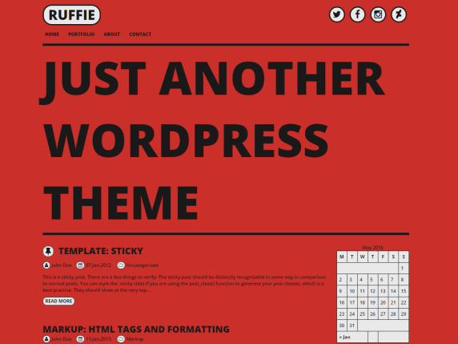
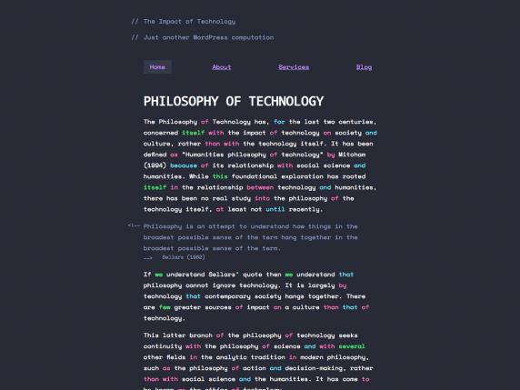
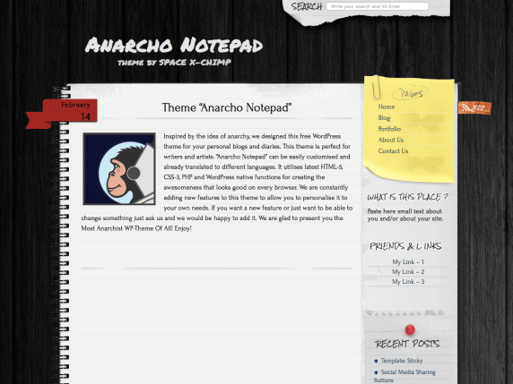
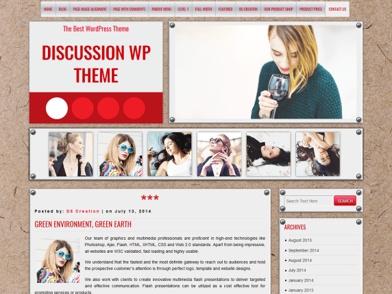
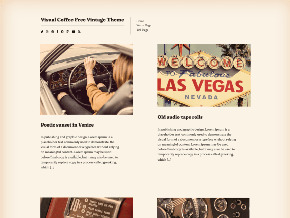

## Favorite WordPress 5.6 Templates from 2020

My five favorite templates for WordPress 5.6 from 2020 archived on GitHub (ZIPs and Screenshots in the Repo).

***

### № 1 — Ruffie

By  [Gratis Themes](https://wordpress.org/themes/author/knifftech/)

[Preview](https://wp-themes.com/ruffie) | [Download](https://downloads.wordpress.org/theme/ruffie.1.5.0.zip)

Version:  **1.5.0** 
Last updated:  **December 29, 2018** 
Active Installations:  **300+** 

[Theme Homepage](https://gratisthemes.github.io/ruffie)

Ruffie is a comic book inspired and responsive theme made with modern devices in mind. The theme has a variety of settings such as background-color, text-color, border-color, layout and social media icons.

###  № 2 — Monostack

By  [Mark Uraine](https://wordpress.org/themes/author/mapk/)

[ Preview](https://wp-themes.com/monostack) | [Download](https://downloads.wordpress.org/theme/monostack.2.0.4.zip)

Version:  **2.0.4** 
Last updated:  **February 27, 2019** 
Active Installations:  **300+** 
WordPress Version:  **4.0 or higher** 

[Theme Homepage](https://github.com/mapk/monostack/)

Monostack is a Gutenberg-ready WordPress theme that brings the beauty of code editors to the frontend. With a strong focus on typography and color, Monostack highlights specific grammar much like syntax highlighting does in code editors. Monostack is named after the "monospace" font stacks used throughout the theme.

### № 3 — Anarcho Notepad

By  [Space X-Chimp](https://wordpress.org/themes/author/arthur-gareginyan/)

[Preview](https://wp-themes.com/anarcho-notepad) | [Download](https://downloads.wordpress.org/theme/anarcho-notepad.2.47.zip)

Version:  **2.47** 
Last updated:  **December 21, 2020** 
Active Installations:  **1,000+** 
WordPress Version:  **4.9 or higher** 
PHP Version:  **5.6 or higher** 

[Theme Homepage](https://www.spacexchimp.com/themes/anarcho-notepad.html)

Inspired by the idea of anarchy, we designed this free WordPress theme for your personal blogs and diaries. This theme is perfect for writers and artists. "Anarcho Notepad" can be easily customized and already translated to different languages. It utilizes latest HTML-5, CSS-3, PHP and WordPress native functions for creating the awesomeness that looks good on every browser. We are constantly adding new features to this theme to allow you to personalize it to your own needs. If you want a new feature or just want to be able to change something just ask us and we would be happy to add it. We are glad to present you the Most Anarchist WP-Theme Of All! Enjoy!

### № 4 — DISCUSSION

By  [D5 Creation](https://wordpress.org/themes/author/d5creation/)

[Preview](https://wp-themes.com/discussion) | [Download](https://downloads.wordpress.org/theme/discussion.1.8.zip)

Version:  **1.8** 
Last updated:  **June 21, 2019** 
Active Installations:  **500+** 
WordPress Version:  **4.0 or higher** 

[Theme Homepage](https://d5creation.com/theme/discussion/)

DISCUSSION is a theme for Bloggers. All the pages, posts and contents are designed on a notice board using push pin and sheets. You may like te stylish design. D5 Creation's Support will be with you, Always!

### № 5 — Visual Coffee

By  [visualcoffee](https://wordpress.org/themes/author/visualcoffee/)

[Preview](https://wp-themes.com/visual-coffee) | [Download](https://downloads.wordpress.org/theme/visual-coffee.1.6.zip)

Version:  **1.6** 
Last updated:  **September 28, 2020** 
Active Installations:  **200+** 
WordPress Version:  **4.7 or higher** 
PHP Version:  **5.6 or higher** 

[Theme Homepage](https://github.com/alinacsava/visual-coffee-free-theme)

Vintage minimalist theme. Includes social media icons (configurable from Appearance -> Customize). View theme demo at https://demo.visual.coffee/free-theme/

---

These templates should at least work with WordPress Version 5.6 (https://wordpress.org/download/releases/).

Sources and Copyright: [WordPress Themes](https://wordpress.org/themes/), template authors or the public.
